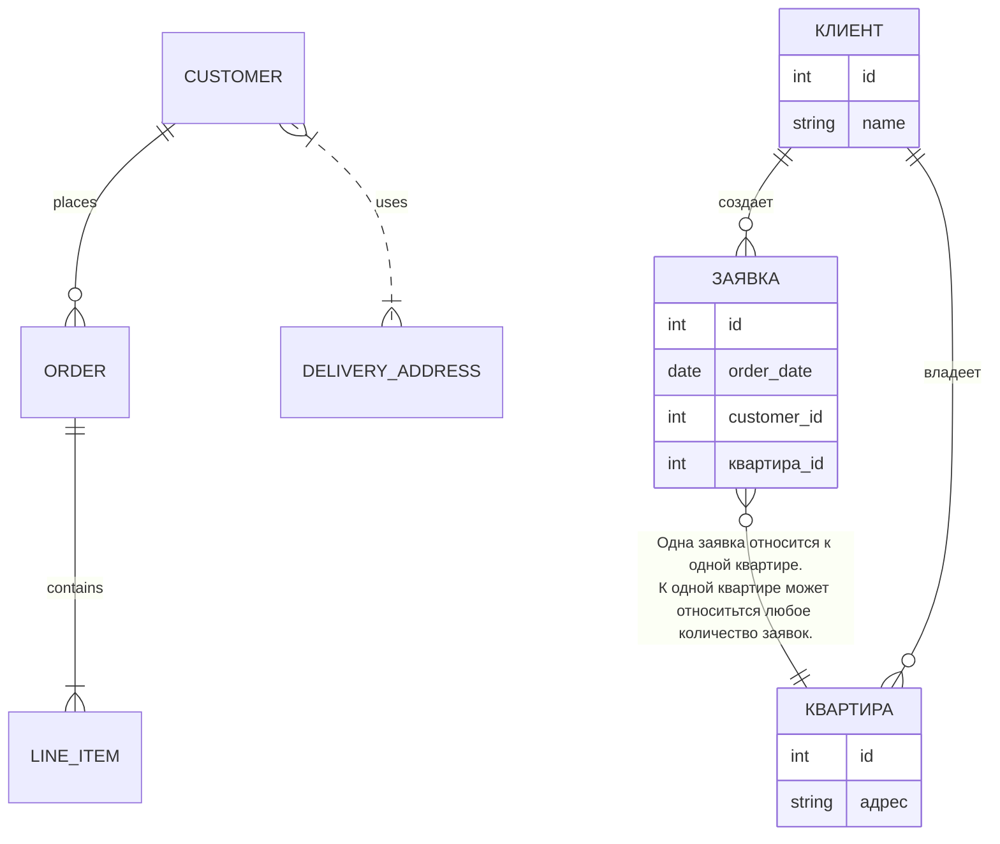

# ERD

```mermaid
erDiagram
    CUSTOMER ||--o{ ORDER : places
    ORDER ||--|{ LINE_ITEM : contains
    CUSTOMER }|..|{ DELIVERY_ADDRESS : uses

    КЛИЕНТ {
        int id
        string name
    }

    ЗАЯВКА {
        int id
        date order_date
        int customer_id
        int квартира_id
    }

    КВАРТИРА {
        int id
        string адрес
    }

    ЗАЯВКА }o--|| КВАРТИРА : "Одна заявка относится к одной квартире.
    К одной квартире может относитьтся любое количество заявок."

    КЛИЕНТ ||--o{ ЗАЯВКА : создает
    КЛИЕНТ ||--o{ КВАРТИРА : владеет
```
